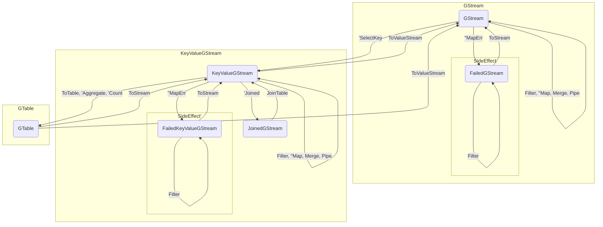
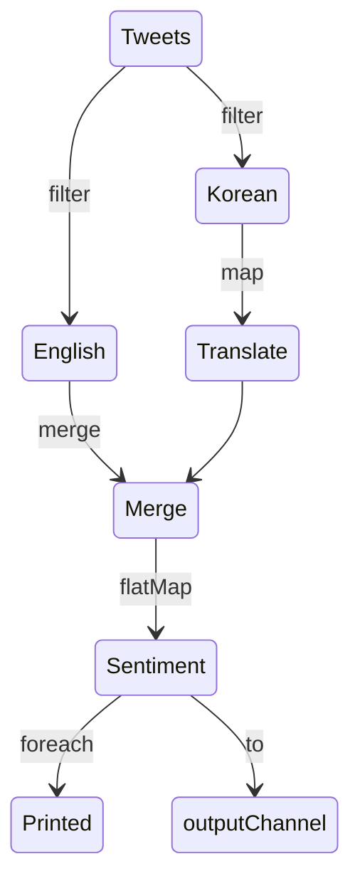

# GStream

Kafka Streams DSL liked, Stream Processing Library abstracting pipelines pattern using generic.

- [Pipelines Pattern](https://go.dev/blog/pipelines)
- [Kafka Streams DSL](https://kafka.apache.org/20/documentation/streams/developer-guide/dsl-api.html)
- [Generics Facilititators](https://rakyll.org/generics-facilititators/)


## Remaining Tasks

- api
  - [ ] Windowing
  - [ ] Table-Table join
- stores
  - [x] BoltDB for read intensive
    - ⚠️ unstable
  - [ ] Pebble for write intensive

## Getting Started

### GStream State Machine

The GStream has similar DSL of [Kafka Streams](https://docs.confluent.io/platform/current/streams/concepts.html#streams-concepts).
The relationship between `Stream` and `Table` is exactly the same as Kafka Streams.
One difference is that GStream has stream without a key.
`KeyValueGStream` has same meaning as `KStream` of Kafka Streams

For map operations with side effects, 
it branches into a success stream and a failure stream.
The success stream is stream for the result of the Map operation being processed.
The failure stream is stream for arguments and errors of the failed operation.


 

### Stateless Example

Let's assume a situation that processing tweet stream for emotion analysis.

1. Tweets are mixed in Korean and English, so Korean tweets should be translated into English.
2. Tweets should be enriched with a sentiment score 
3. Enriched data are printed and send to output channel

The stream graph is as follows



First, define some structs to be used in stream

```go
type Tweet struct {
	ID   int
	Lang string
	Text string
}

type Sentiment struct {
	ID    int
	Text  string
	Score float64
}
```

Then, create source stream through input channel.

```go
tweetCh := make(chan tweet)
// emit Tweet to tweetCh

builder := gstream.NewBuilder()
tweets := gstream.Stream[Tweet](builder).From(tweetCh)
```

Then, build stream according to the previous graph

```go
// branch into english
english := tweets.Filter(func(t Tweet) bool { 
	return t.Lang == "en"
})

// brnach into korean and translate
translate := tweet.Filter(func(t Tweet) bool {
    return t.Lang == "kr"
}).Map(func(ctx context.Context, t Tweet) Tweet {
	// translate t.Text to English
	return translated
})

// merge english and translate branch
merged := english.Merge(translate)

// enrich tweet
sentiment := gstream.FlatMap(merged, func(ctx context.Context, t Tweet) []Sentiment {
	// calculate sentiment score of t.Text and enrich tweet
	return enriched
})

// print sentiment
sentiment.Foreach(func(_ context.Context, s Sentiment) {
	fmt.Println(s)
})
// get chan of sentiment
outputCh := sentiment.To()
```

finally, start stream to processing tweets.

```go
builder.BuildAndStart(ctx)
```

The stream terminates when all input channels are closed or context is cancelled.
`BuildAndStart` func will be blocked until the stream ends.


### Stateful Example

### Backpressure

