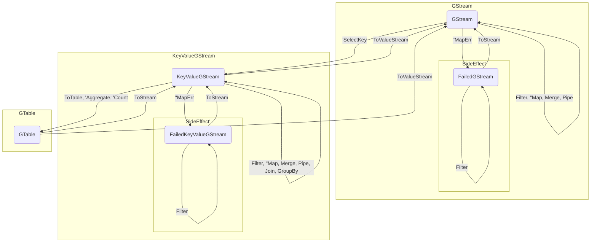
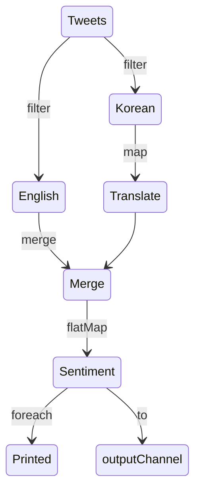
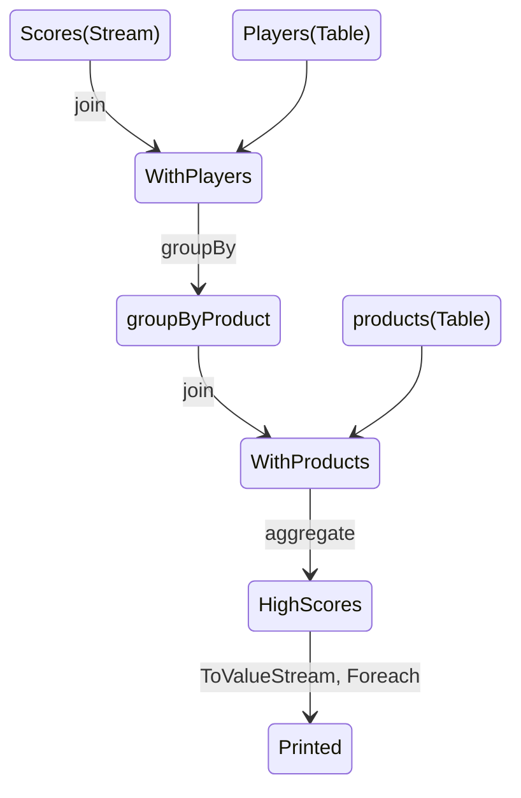

# GStream

[](https://goreportcard.com/report/github.com/KumKeeHyun/gstream)
[](https://godoc.org/github.com/KumKeeHyun/gstream)

Kafka Streams DSL liked, Stream Processing Library abstracting pipelines pattern using generic.

- [Pipelines Pattern](https://go.dev/blog/pipelines)
- [Kafka Streams DSL](https://kafka.apache.org/20/documentation/streams/developer-guide/dsl-api.html)
- [Generics Facilititators](https://rakyll.org/generics-facilititators/)

## Remaining Tasks

- api
  - [ ] Windowing
  - [ ] Table-Table join
- stores
  - [x] BoltDB for read intensive
    - ⚠️ unstable
  - [ ] Pebble for write intensive

## Getting Started

### GStream State Machine

The GStream has similar DSL of [Kafka Streams](https://docs.confluent.io/platform/current/streams/concepts.html#streams-concepts).
The relationship between `Stream` and `Table` is exactly the same as Kafka Streams.
One difference is that GStream has stream without a key.
`KeyValueGStream` has same meaning as `KStream` of Kafka Streams

For map operations with side effects, 
it branches into a success stream and a failure stream.
The success stream is stream for the result of the Map operation being processed.
The failure stream is stream for arguments and errors of the failed operation.


### Stateless Example

Let's assume a situation that processing tweet stream for emotion analysis.

1. Tweets are mixed in Korean and English, so Korean tweets should be translated into English.
2. Tweets should be enriched with a sentiment score 
3. Enriched data are printed and send to output channel

The stream graph is as follows



First, define some structs to be used in stream

```go
type Tweet struct {
	ID   int
	Lang string
	Text string
}

type Sentiment struct {
	ID    int
	Text  string
	Score float64
}
```

Then, create source stream through input channel.

```go
tweetCh := make(chan Tweet)
// emit Tweet to tweetCh

builder := gstream.NewBuilder()
tweets := gstream.Stream[Tweet](builder).From(tweetCh)
```

Then, build stream according to the previous graph

```go
// branch into english
english := tweets.Filter(func(t Tweet) bool { 
	return t.Lang == "en"
})

// brnach into korean and translate
translate := tweets.Filter(func(t Tweet) bool {
    return t.Lang == "kr"
}).Map(func(ctx context.Context, t Tweet) Tweet {
	// translate t.Text to English
	return translated
})

// merge english and translate branch
merged := english.Merge(translate)

// enrich tweet
sentiment := gstream.FlatMap(merged, func(ctx context.Context, t Tweet) []Sentiment {
	// calculate sentiment score of t.Text and enrich tweet
	return enriched
})

// print sentiment
sentiment.Foreach(func(_ context.Context, s Sentiment) {
	fmt.Println(s)
})
// get chan of sentiment
outputCh := sentiment.To()
```

finally, start stream to processing tweets.

```go
builder.BuildAndStart(ctx)
```

The stream terminates when all input channels are closed or context is cancelled.
`BuildAndStart` func will be blocked until the stream ends.


### Stateful Example

Let's assume a situation that processing video game leaderboard.

1. ScoreEvent should be enriched with player.
2. Score with player records are keyed by playerID. They should be grouped by productID for join with product.
3. Score with player should be enriched with product.
4. Calculate the top three high scores for each game through aggregating enriched records.

The stream graph is as follows



Define Player, Product, ScoreEvent structs and implement HighScores that calculating the top three high scores.

```go
type Player struct {
	ID   int
	Name string
}

type Product struct {
	ID   int
	Name string
}

type ScoreEvent struct {
	PlayerID  int
	ProductID int
	Score     float64
}

type ScoreWithPlayer struct {
	Player Player
	Score  ScoreEvent
}

type Enriched struct {
	PlayerID    int
	PlayerName  string
	ProductID   int
	ProductName string
	Score       float64
}

type HighScores struct {
	highScores []Enriched
}

func (s *HighScores) Add(e Enriched) {
	added := append(s.highScores, e)
	sort.SliceStable(added, func(i, j int) bool {
		return added[i].Score > added[j].Score
	})
	if len(added) > 3 {
		added = added[:3]
	}
	s.highScores = added
}
```

Build stream according to the previous graph.

```go
b := NewBuilder()

players := Table[int, Player](b).From(
	playerCh,
	func(p Player) int { return p.ID }, // keySelector
	state.NewOptions[int, Player](), // using default state options(in-memory store)
)
products := Table[int, Product](b).From(
	productCh,
	func(p Product) int { return p.ID },
	state.NewOptions[int, Product](),
)
scores := SelectKey[int, ScoreEvent](
	Stream[ScoreEvent](b).From(scoreCh),
	func(s ScoreEvent) int { return s.PlayerID },
)
	
// ScoreEvent join with player by playerID
withPlayers := JoinStreamTable(
	scores, // left stream
	players, // right table
	func(id int, score ScoreEvent, player Player) ScoreWithPlayer { // joiner
		return ScoreWithPlayer{
			Player: player,
			Score:  score,
		}
	},
)

// Group by productID
groupByProduct := GroupBy(
	withPlayers,
	func(playerID int, withPlayer ScoreWithPlayer) int { // key mapper
		return withPlayer.Score.ProductID
	},
)

// withPlayer join with product by productID
withProducts := JoinStreamTable(
	groupByProduct,
	products,
	func(playerID int, withPlayer ScoreWithPlayer, product Product) Enriched {
		return Enriched{
			PlayerID:    withPlayer.Player.ID,
			PlayerName:  withPlayer.Player.Name,
			ProductID:   product.ID,
			ProductName: product.Name,
			Score:       withPlayer.Score.Score,
		}
	},
)

// Perform the aggregation
Aggregate[int, Enriched, *HighScores](
	withProducts,
	func() *HighScores { // initializer
		return &HighScores{highScores: []Enriched{}}
	},
	func(kv KeyValue[int, Enriched], aggregate *HighScores) *HighScores { // aggregater
		aggregate.Add(kv.Value)
		return aggregate
	},
	state.NewOptions[int, *HighScores](), // state options
).
	ToValueStream().
	Foreach(func(_ context.Context, hs *HighScores) {
		fmt.Println(hs.highScores)
	})
```

#### State Options

The operations that create `GTable` receive `state.Options` as parameter.

```go
func (tb *tableBuilder[K, V]) From(pipe <-chan V, selectKey func(V) K, sopt state.Options[K, V], opts ...source.Option) GTable[K, V]

type KeyValueGStream[K, V any] interface {
	// ...
    ToTable(state.Options[K, V]) GTable[K, V]
	// ...
}

func Aggregate[K, V, VR any](kvs KeyValueGStream[K, V], initializer func() VR, aggregator func(KeyValue[K, V], VR) VR, sopt state.Options[K, VR]) GTable[K, VR]

func Count[K, V any](kvs KeyValueGStream[K, V], sopt state.Options[K, int]) GTable[K, int]
```

The state options are as follows

```go
// constructor using option pattern.
func NewOptions[K, V any](opts ...Option[K, V]) Options[K, V]

// set custom key serializer/deserializer.
// default is json serde.
func WithKeySerde[K, V any](keySerde Serde[K]) Option[K, V]
// set custom value serializer/deserializer.
// default is json serde.
func WithValueSerde[K, V any](valueSerde Serde[V]) Option[K, V]
// use in-memory store.
// default store type.
func WithInMemory[K, V any]() Option[K, V]
// use boltDB persistent store.
func WithBoltDB[K, V any](name string) Option[K, V]
```

### Backpressure

By default, a pipeline with single source stream processes records with single goroutine. 
If , we can specify the number of concurrent worker of pipeline to handle backpressure.

```go
gstream.Stream[string](ch, source.WithWorkerPool(3))
gstream.Table[int, string](ch, keySelector, stateOpt, source.WithWorkerPool(3))

stream.Pipe(pipe.WithWorkerPool(3))
stream.Merge(otherStream, pipe.WithWorkerPool(3))
```

Since the capacity of pipe channel is 0, it is blocking when consumer not ready to consume. 
we can configure the capacity of the pipe or sink channel.

Additionally, we can set a timeout of sink output channel for the drop.

```go
stream.Pipe(
	pipe.WithWorkerPool(3),
	pipe.WithBufferedChan(100), 
)

stream.To(
	sink.WithBufferedChan(100),
	sink.WithTimeout(time.Second * 2)
)
```