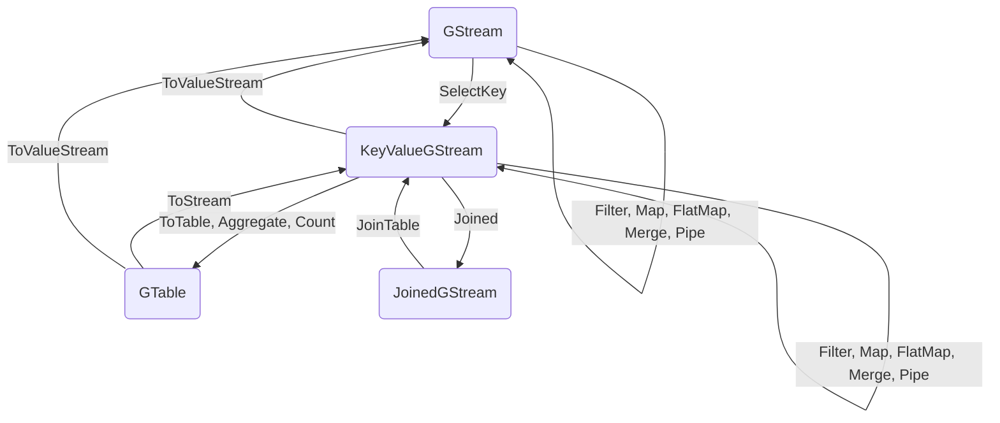
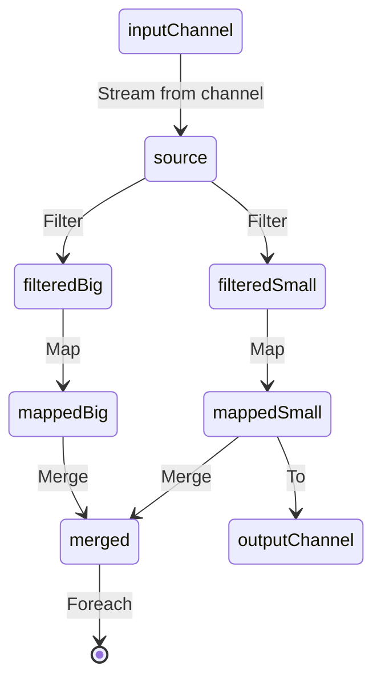
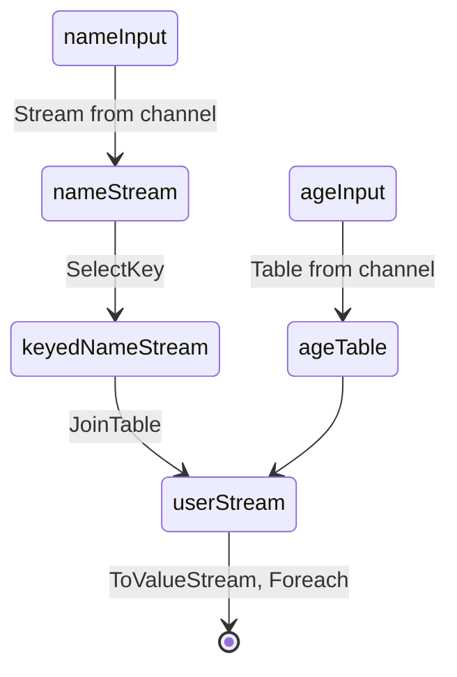

# GStream

Kafka Streams DSL liked, Stream Processing Library abstracting pipelines pattern using generic.

- [Pipelines Pattern](https://go.dev/blog/pipelines)
- [Generics Facilititators](https://rakyll.org/generics-facilititators/)
- [Kafka Streams DSL](https://kafka.apache.org/20/documentation/streams/developer-guide/dsl-api.html)

## TODO

- [x] aggregating
- [ ] windowing
- [ ] table-table join
- [ ] boltDB kvstore

## Benchmark

```
goos: linux
goarch: amd64
pkg: github.com/KumKeeHyun/gstream
cpu: Intel(R) Xeon(R) CPU @ 2.20GHz
BenchmarkGenericSize1000-4            	   46689	     24067 ns/op	   33016 B/op	       3 allocs/op
BenchmarkGStreamSize1000-4            	    3979	    303984 ns/op	   31595 B/op	      63 allocs/op
BenchmarkGenericSize100000-4          	     381	   2726237 ns/op	 4276250 B/op	       4 allocs/op
BenchmarkGStreamSize100000-4          	      42	  26607581 ns/op	 3878168 B/op	      68 allocs/op
BenchmarkGeneric10TimesSize1000-4     	      21	  51791600 ns/op	61577996 B/op	      49 allocs/op
BenchmarkGStream10TimesSize1000-4     	    2452	    474098 ns/op	   35988 B/op	     207 allocs/op
BenchmarkGStream10TimesSize100000-4   	      28	  40920763 ns/op	 3882629 B/op	     212 allocs/op
PASS
ok  	github.com/KumKeeHyun/gstream	15.228s
```

## How To Use



### Stateless

- topology



- build stream

```go
builder := gstream.NewBuilder()

input := make(chan int)
source := gstream.Stream[int](builder).From(input)

filteredBig := source.Filter(func(i int) bool {
	return i > 10
})
mappedBig := gstream.Map(filteredBig, func(i int) string {
	return fmt.Sprintf("big-%d", i)
})

filteredSmall := source.Filter(func(i int) bool {
	return i <= 10
})
mappedSmall := gstream.Map(filteredSmall, func(i int) string {
	return fmt.Sprintf("small-%d", i)
})
smallOutput := mappedSmall.To()
mappedSmall.Merge(mappedBig).
	Foreach(func(s string) {
		fmt.Println("merged:", s)
	})
```


### Stateful

- topology



- build stream

```go
builder := gstream.NewBuilder()

ageInput := make(chan UserAge)
ageMater, err := materialized.New(
	materialized.WithInMemory[int, UserAge](),
)
if err != nil {
	// handle error
}
ageTable := gstream.Table[int, UserAge](builder).
	From(ageInput, ageKeySelector, ageMater)

nameInput := make(chan UserName)
nameStream := gstream.Stream[UserName](builder).
	From(nameInput)

keyedNameStream := gstream.SelectKey(nameStream, nameKeySelector)
gstream.Joined[int, UserName, UserAge, User](keyedNameStream).
	JoinTable(ageTable, userJoiner).
	ToValueStream().
	Foreach(func(u User) {
		fmt.Println(u)
	})

close := builder.BuildAndStart()
```